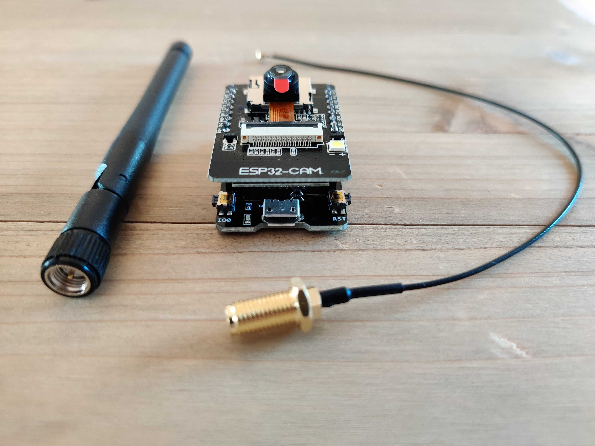
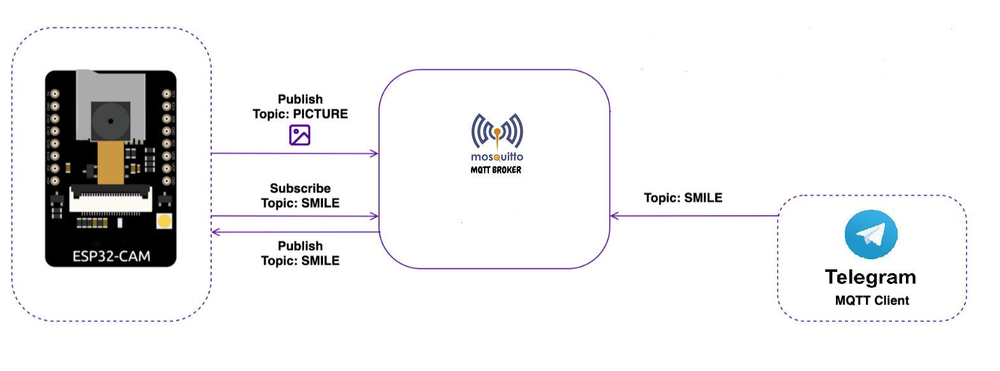

# Telegram Bot for ESP32-CAM



## Architecture


## Requirements
* Ubuntu v22.04 (2CPU, 40GB HDD, 8Gb RAM)
* Mosquitto
* Prometheus
* Grafana 
* Docker-compose
* Python

## Install Docker and Docker-compose
```BASH
sudo apt update
sudo apt install -y ca-certificates curl gnupg lsb-release
sudo mkdir -p /etc/apt/keyrings
curl -fsSL https://download.docker.com/linux/ubuntu/gpg | sudo gpg --dearmor -o /etc/apt/keyrings/docker.gpg
sudo echo  "deb [arch=$(dpkg --print-architecture) signed-by=/etc/apt/keyrings/docker.gpg] https://download.docker.com/linux/ubuntu  $(lsb_release -cs) stable" | sudo tee /etc/apt/sources.list.d/docker.list > /dev/null
sudo apt update
sudo apt install -y docker-ce docker-ce-cli containerd.io docker-compose-plugin
##Run Docker as a non-root user
sudo groupadd docker
sudo usermod -aG docker $USER
##
sudo curl -L "https://github.com/docker/compose/releases/latest/download/docker-compose-$(uname -s)-$(uname -m)" -o /usr/local/bin/docker-compose
sudo chmod +x /usr/local/bin/docker-compose
```

## Install Mosquitto
```BASH
git clone https://github.com/geksogen/Telegram_CAM_Bot.git
cd MQTT-Self-Hostin-Mosquitto
docker-compose up -d
docker-compose ps

NAME                 IMAGE                                          COMMAND                  SERVICE              CREATED             STATUS          PORTS
grafana              grafana/grafana:10.4.2                         "/run.sh"                grafana              About an hour ago   Up 55 minutes   0.0.0.0:3000->3000/tcp, :::3000->3000/tcp
mosquitto            eclipse-mosquitto                              "/docker-entrypoint.…"   mosquitto            2 hours ago         Up 55 minutes   0.0.0.0:1883->1883/tcp, :::1883->1883/tcp, 0.0.0.0:9001->9001/tcp, :::9001->9001/tcp
mosquitto-exporter   alessandrovito/mosquitto-exporter-docker:1.0   "/run.sh"                mosquitto-exporter   2 hours ago         Up 54 minutes   0.0.0.0:9180->9180/tcp, :::9180->9180/tcp
prometheus           prom/prometheus:v2.51.2                        "/bin/prometheus --c…"   prometheus           About an hour ago   Up 55 minutes   0.0.0.0:9090->9090/tcp, :::9090->9090/tcp

```
### Regenerate password
```BASH
docker exec -it mosquitto sh
mosquitto_passwd -U /etc/mosquitto/passwd
docker-compose restart
docker-compose restart mosquitto-exporter
```

## Build Image TG-Bot
```BASH
git clone https://github.com/geksogen/Telegram_CAM_Bot.git
cd TG_Bot
sudo docker build -t tg_bot:1 .
sudo docker run --rm -d --name tg_bot --network=host tg_bot:1
```

## Clear
```BASH
docker-compose down --rmi all -v --remove-orphans
docker stop $(docker ps -a -q)
docker rm $(docker ps -a -q)
docker network prune
docker system prune -a
```

## To-do
* [Add Kuma to Monitoring](https://medium.com/@tomer.klein/real-time-uptime-monitoring-with-uptime-kuma-and-grafana-16638d6a579f)
* [Add MQTT-Nginx-SSL](https://admintuts.net/server-admin/how-to-configure-mosquitto-with-nginx-reverse-proxy)
